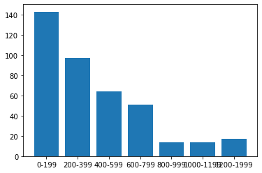
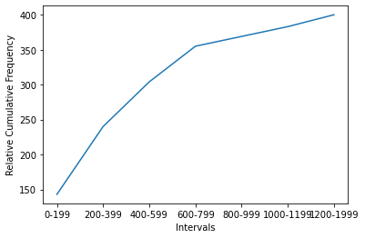
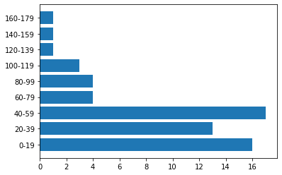

Part 1

Challenge 1

Find a and b, if median=42, mean=50 20,34, 34, 12, 56, 110, 49, a, b.


```python
# a and b are 42 and 93
```

Challenge 2

A car hit an average speed of v1 = 60 kmph in the first half of the journey, and hit an average speed of v2 = 110 kmph in the second half of the journey. Determine the average speed of the car.


```python
# assumme total journey = 200 km
# first 100 km: 60 kmh > 100/60 H used
# second 100 km: 110 kmh > 100/110 H used

# total: 200km / ((100/60)+(100/110)) = 77.65 kmh
```

Challenge 3

The lifetimes of 400 light-bulbs were found to the nearest hour. The results were recorded as follows. Lifetime (hours) 0–199 200–399 400–599 600–799 800–999 1000–1199 1200–1999 Frequency 143 97 64 51 14 14 17 Construct a histogram and cumulative frequency polygon for this dataset. Estimate the percentage of bulbs with lifetime less than 480 hours.


```python
x = ['0-199', '200-399', '400-599', '600-799', '800-999', '1000-1199', '1200-1999']
y = [143, 97, 64, 51, 14, 14, 17]

import pandas as pd
import matplotlib.pyplot as plt
import seaborn as sns
import warnings
import numpy as np

# histogram
plt.bar(x,y)
```


    <BarContainer object of 7 artists>


    

    


```python
# cumulative frequency polygon

plt.ylabel('Relative Cumulative Frequency')
plt.xlabel('Intervals')
Y = np.cumsum(y)
plt.plot(x, Y)
plt.show()
```


    

    


```python
# 240+((480-400)/200)*(304-240) = 265.6
# 265.6/400 = 66.4%
```

Challenge 4

The time between arrival of 60 patients at an intensive care unit were recorded to the nearest hour. The data are shown below. Time (hours) 0–19 20–39 40–59 60–79 80–99 100–119 120–139 140–159 160–179 Frequency 16 13 17 4 4 3 1 1 1 Determine the median, mean and standard deviation for this dataset.


```python
x = ['0-19', '20-39', '40-59', '60-79', '80-99', '100-119', '120-139', '140-159', '160-179']
y = [16, 13, 17, 4, 4, 3, 1, 1, 1]
plt.barh(x, y)
plt.show()
```


    

    


```python
# Median
# 40+((60/2)-29)/17*19 = 41.12

# Mean
# (169.5*1 + 149.5*1 + 129.5*1 + 109.5*3 + 89.5*4 + 69.5*4 + 49.5*17 + 29.5*13 + 9.5*16)/60 = 46.5

# Standard Deviation
# variance = ((169.5-46.5)**2*1 + (149.5-46.5)**2*1 + (129.5-46.5)**2*1 + (109.5-46.5)**2*3 + (89.5-46.5)**2*4 + (69.5-46.5)**2*4 + (49.5-46.5)**2*17 + (29.5-46.5)**2*13 + (9.5-46.5)**2*16)/60 = 1331
# STD = 36.48
```

Part 2

Challenge 1

One player rolls two dices. Describe the measurable space and the random variable for:

A. The values that the player obtains.


```python
# (1,1), (1,2), (1,3), (1,4), (1,5), (1,6)
# (2,1), (2,2), (2,3), (2,4), (2,5), (2,6)
# (3,1), (3,2), (3,3), (3,4), (3,5), (3,6)
# (4,1), (4,2), (4,3), (4,4), (4,5), (4,6)
# (5,1), (5,2), (5,3), (5,4), (5,5), (5,6)
# (6,1), (6,2), (6,3), (6,4), (6,5), (6,6)
```

B. The sum of the values obtained.


```python
# possible_sum = [2, 3, 4, 5, 6, 7, 8, 9, 10, 11, 12]
```

C. The maximum value obtained after rolling both dices.


```python
# maximum = 12
```

Describe the following events:

Case A: Both values are greater than 5.


```python
# (6,6)
```

Case B: The sum of values is even.


```python
# (1,1), (1,3), (1,5)
# (2,2), (2,4), (2,6)
# (3,1), (3,3), (3,5)
# (4,2), (4,4), (4,6)
# (5,1), (5,3), (5,5)
# (6,2), (6,4), (6,6)
```

Case C: The maximum is the value of both rolls.


```python
# (6,6)
```

Challenge 2

One player picks two cards from a poker deck. Describe the measurable space and the random variable for:

A. The number of figures he picks.


```python
# pick two cards from 52 >> 51*52/2 = 1326 possibilities
# cards number from 1-13 and 4 colors
```

B. The sum of card values. Consider that the value of figures is 10 and the value of aces is 15.


```python
# (2,2), (2,3), (2,4), (2,5), (2,6), (2,7), (2,8), (2,9), (2,10), (2,15)
# 4, 5, 6, 7, 8, 9, 10, 11, 12, 17

# Others: (3, 15), (3, 10), (4, 15), (4, 10), (5, 15), (5, 10), (6, 15), (6, 10), 
# (7, 15), (8, 15), (8, 10), (9, 15), (9, 10), (10, 15), (10, 10), (15, 15)
# 18, 13, 19, 14, 20, 15, 21, 16, 22, 23, 24, 25

# Total : [4, 5, 6, 7, 8, 9, 10, 11, 12, 13, 14, 15, 16, 17, 18, 19, 20, 21, 22, 23, 24, 25, 30]
```

C. The number of hearts or spades he picks.


```python
# (0,0), (h,0), (0,h), (s,0), (0,s), (h,s), (s,h)
```

Describe the following events:

Case A: The number of figures in the cards the player picked is two.


```python
# two figures: (J,J), (J,Q), (J,K), (Q,J), (Q,Q), (Q,K), (K,J), (K,Q), (K,K)
```

Case B: The sum of card values is 17.


```python
# (4,K), (5,Q), (6,J), (7,10), (8,9), (9,8), (10,7), (J,6), (Q,5), (K,4)
```

Case C: The value of both cards is less than 8.


```python
# (1,1), (1,2), (1,3), (1,4), (1,5), (1,6), (1,7)
# (2,1), (2,2), (2,3), (2,4), (2,5), (2,6), (2,7)
# (3,1), (3,2), (3,3), (3,4), (3,5), (3,6), (3,7)
# (4,1), (4,2), (4,3), (4,4), (4,5), (4,6), (4,7)
# (5,1), (5,2), (5,3), (5,4), (5,5), (5,6), (5,7)
# (6,1), (6,2), (6,3), (6,4), (6,5), (6,6), (6,7)
# (7,1), (7,2), (7,3), (7,4), (7,5), (7,6), (7,7)
```

Challenge 3

Two players roll a dice. Describe the measurable space and the random variable for:

A. The score of player A.


```python
# score = [1, 2, 3, 4, 5, 6]
```

B. The greatest score.


```python
# greatest_score = 6
```

C. The earnings of player A if the game rules state that:
"The player with the greatest score gets a coin from the other player.".


```python
# (1,0) or (0,1)
```

D. The earnings of player A if the game rules state that:
"The player with the greatest score gets as many coins as the difference between the score of player A and player B.".


```python
# possible_coins_earned = [1, 2, 3, 4, 5]
```

Describe the following events:

Case A: The score of player A is 2.


```python
# (2,1), (2,2), (2,3), (2,4), (2,5), (2,6)
```

Case B: The greatest score is lower or equal than 2.


```python
# (1,1), (1,2), (2,1), (2,2)
```

Case C: Considering the case where the winner gets as many coins as the difference between scores

(D), describe:
Player A wins at least 4 coins.
Player A loses more than 2 coins.
Player A neither wins nor loses coins.


```python
# Player A wins at least 4 coins:
# (6,1), (6,2), (5,1)

# Player A loses more than 2 coins:
# (1,4), (1,5), (1,6)
# (2,5), (2,6)
# (3,6)

# Player A neither wins or loses coins:
# (1,1), (2,2), (3,3), (4,4), (5,5), (6,6)
```

Part 3 - SQL


```python
# CREATE TABLE challenge_3 (student_id int primary key, score int);
# INSERT INTO challenge_3 (student_id, score)
# VALUES (1,91), (2,72), (3,98), (4,62), (5,62), (6,95), (7,83), (8,86), (9,56), (10,97),
# (11,58), (12,71), (13,87), (14,83), (15,98);

# MEAN
# SELECT avg(score)
# FROM challenge_3;

# SUM
# SELECT sum(score)
# FROM challenge_3;

# Standard Deviation
# SELECT STDDEV(score)
# FROM challenge_3;  

# Variance
# SELECT VARIANCE(score)
# FROM challenge_3;

# MIN
# SELECT min(score)
# FROM challenge_3;

# MAX
# SELECT max(score)
# FROM challenge_3;
```
